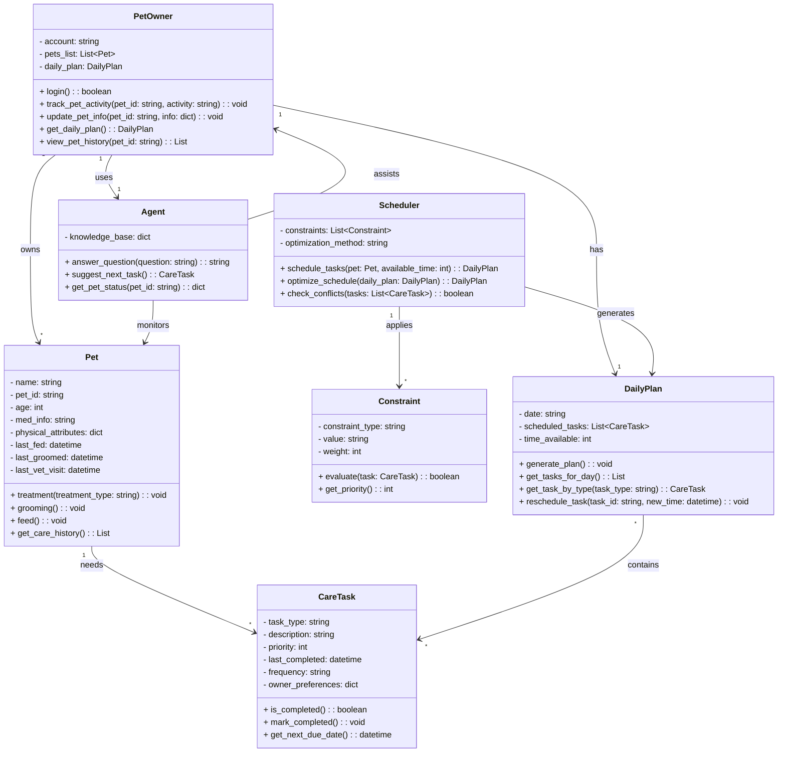

# PawPal+ System UML Class Diagram

## System Description

### Core Components

**PetOwner**
- Manages user account and pet collection
- Tracks daily care activities and pet information
- Interacts with AI agent for guidance

**Pet**
- Stores pet information and care history
- Tracks key metrics (last fed, groomed, vet visit)
- Manages breed-specific or individual care protocols

**CareTask**
- Represents individual care activities (feeding, meds, grooming, enrichment)
- Tracks completion history and frequency
- Incorporates owner preferences

**Constraint**
- Enforces scheduling limitations (time available, priority, owner preferences)
- Each constraint has a weight for optimization

**DailyPlan**
- Generates optimized schedule for the day
- Allocates time and tasks based on constraints
- Allows rescheduling and task management

**Scheduler**
- Core logic for task scheduling
- Balances multiple constraints
- Detects and resolves scheduling conflicts

**Agent**
- AI component for answering care questions
- Provides status updates and recommendations
- Learns from user patterns and pet history

